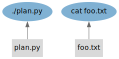
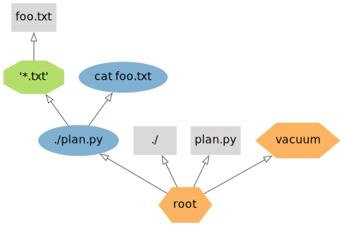

# Static Deferred Glob

When dealing with massive datasets comprising tens of thousands of files, it doesn't make sense to render all of them as static when only a handful will actually be utilized.
StepUp addresses this issue with the *deferred glob* feature,
which makes previously unknown files static when:

1. they are used as inputs of a new step and
2. they match a deferred glob pattern.


## Example

Example source files: [advanced_topics/static_deferred_glob/](https://github.com/reproducible-reporting/stepup-core/tree/main/docs/advanced_topics/static_deferred_glob)

Create two text files with some content: `foo.txt` and `bar.txt`,
and also the following `plan.py`:

```python

```

Run the plan interactively with StepUp:

```bash
chmod +x plan.py
stepup -n -w1
```

You should get the following screen output:

```

```

As expected, `foo.txt` is used as a static file.
Of course, this would also have been the case without the `_defer=True` option.
The key difference is that with `_defer=True`, StepUp does not create a list of all matching `*.txt` files.
This can be seen when examining the file `graph.txt`, which has no trace of `bar.txt`:

```

```

The node `dg:'*.txt;` in the graph (green octagon in the figures below) is the result of adding the `_defer=True` option.
This node will create static files as they are needed by other steps.
The deferred glob is ideal when there are a large number of files that could match the pattern,
of which most are irrelevant for the build.
For example, there could be thousands of `.txt` files in this scenario, but
this would not have any effect on the resources consumed by StepUp.

The **supplier graph**:



The **creator graph**:




## Try the Following

- When using deferred globs, steps cannot create outputs that match the deferred glob.
  This would mean that a built file could be made static when used as input later,
  which is clearly inconsistent.
  Try causing this error by adding a step `copy("foo.txt", "foo2.txt")`.

- Remove the `_defer=True` option and inspect the corresponding `graph.txt`.
  You should see that `bar.txt` is now indeed included in the graph.
