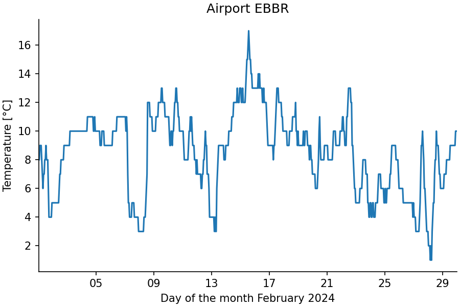
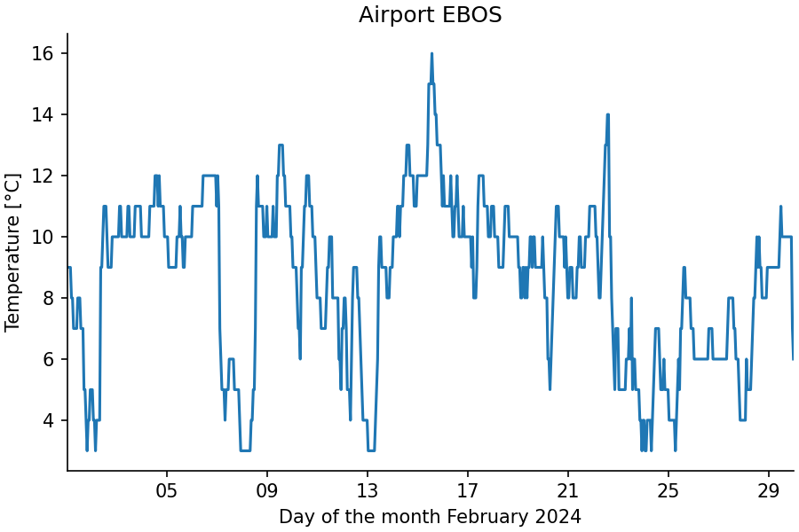

# Function Calls

StepUp Core implements a *call protocol*
for invoking named functions in scripts from a `plan.py` file.
Each [`call()`][stepup.core.api.call] registers exactly one step,
and a called function may itself call `call()` to register further steps,
enabling arbitrarily deep, dynamic planning.

## Call Protocol

The following `plan.py`:

```python
#!/usr/bin/env python3
from stepup.core.api import call, static

static("./cat.py", "data.txt")
call("./cat.py", "main", inp="data.txt", out="result.txt")
```

registers a step that runs:

```bash
./cat.py main '{"inp": ["data.txt"], "out": ["result.txt"]}'
```

The function name (`"main"`) is the first command-line argument
and the serialized keyword arguments are the second.
StepUp treats the command string as part of the step's digest,
so any change to the arguments automatically triggers a re-run.

## The `driver()` Function

The call protocol does not require the called script,
e.g. `./cat.py` in the previous example, to be a Python script.
However, in practice, that will often be the case.
To facilitate writing such Python scripts,
StepUp provides [`driver()`][stepup.core.call.driver],
which dispatches to the appropriate function based on the first command-line argument.

Add `driver()` to the `if __name__ == "__main__":` block of any Python script
called via `call()`:

```python
#!/usr/bin/env python3
from stepup.core.call import driver

def main(inp, out):
    if len(out) != 1:
        raise ValueError("Exactly one output file must be specified")
    with open(out[0], "w") as f:
        for path in inp:
            f.write(open(path).read())

if __name__ == "__main__":
    driver()
```

When the script is invoked with a function name as the first argument,
`driver()` dispatches to the matching function by name.
When invoked without any arguments, it prints one suggested command line
per callable function defined in the script, which may aid discovery:

```bash
$ ./cat.py
./cat.py main '{"inp": null, "out": null}'
```

The function only declares the parameters it actually uses.
`inp` and `out` are always forwarded as lists,
even if they were passed as a single string to `call()`.

You can prefix private functions with an underscore (`_`),
e.g. `_helper()`, to hide them from `driver()`.
Imported names are also excluded automatically.
To override the default selection of callable functions, list them explicitly in `__all__`.

## Passing kwargs

Any JSON-serializable keyword argument passed to `call()` is forwarded to the function.
The function's signature determines which parameters it receives.
Passing a keyword argument that the function does not declare raises a `TypeError`,
so typos in argument names are caught at execution time rather than silently ignored.
The only exceptions are `inp` and `out`, which are silently dropped when absent
from the function's signature, since many functions do not need both.

```python
# plan.py — pass a threshold to the run function
call("./work.py", "run", inp=["data.txt"], out=["result.txt"], threshold=0.5)
```

```python
# work.py
from stepup.core.call import driver


def run(inp: list[str], out: list[str], threshold: float):
    ...


if __name__ == "__main__":
    driver()
```

Type annotations on the function parameters are respected:
`driver()` uses [cattrs](https://github.com/python-attrs/cattrs)
to coerce and validate each argument before calling the function.

## `args_file` Variant

When the JSON-serialized arguments are large,
they may become impractical to include inline on the command line.
You can also use an `args_file` to keep the commands short and readable:

```python
call("./work.py", "run",
     inp=["data.txt"], out=["result.txt"],
     args_file="run_args.json")
```

This writes the arguments to `run_args.json`
(using [`dumpns()`][stepup.core.api.dumpns])
and passes `--inp=run_args.json` to the script instead of an inline JSON string.
StepUp tracks `run_args.json` as an output of the calling step and an input of the called step,
so changes to the arguments are detected through the file's hash.

Supported extensions are `.json`, `.yaml`, and `.yml`.

## Two-Phase Example

Example source files: [`docs/getting_started/call/`](https://github.com/reproducible-reporting/stepup-core/tree/main/docs/getting_started/call)

The real power of `call()` is composing steps dynamically.
One common pattern is a two-phase script, where a `plan()` function registers a `run()` function.
The benefit of such a split is that the top-level `./plan.py`
can focus on the high-level logic of the workflow,
while some details of the workflow are deferred to the `plan()` function of the called script.

To make the example more engaging,
it leverages [NumPy](https://numpy.org/) and [Matplotlib](https://matplotlib.org/).
The same plotting function is applied to two datasets of hourly temperatures recorded at
the airports of Brussels and Ostend in February 2024, downloaded from the
[ASOS network hosted by Iowa State University](https://mesonet.agron.iastate.edu/request/download.phtml).

Add the following `plan.py`:

```python

```

And `plot.py` with both a `plan()` and a `run()` function,
and a `driver()` entry point:

```python

```

It is assumed that the input files `ebbr.csv`, `ebos.csv`, and `matplotlibrc`
are present in the same directory as `plan.py` and `plot.py`.
Make the Python scripts executable and run StepUp:

```bash
chmod +x plan.py plot.py
stepup boot -j 1
```

You should see output like:

```text

```

This produces the following figures:




## Try the Following

- Modify `matplotlibrc` and re-run StepUp.
  Only the `plot.py run ...` steps re-execute because `matplotlibrc`
  is an input to the `run()` function, not the `plan()` function.

- Add a third CSV file with weather data from an airport of your choice,
  and extend `plan.py` accordingly.
