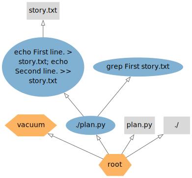

# Dependencies

This tutorial demonstrates how StepUp tracks dependencies.


## Example

Example source files: [getting_started/dependencies/](https://github.com/reproducible-reporting/stepup-core/tree/main/docs/getting_started/dependencies)

The following `plan.py` defines two steps, with the second making use of the output from the first.

```python

```

The placeholders `${inp}` and `${out}` are replaced by the `inp` and `out` keyword arguments.
(This happens early, before the steps are sent to the director process.)

The `graph()` function writes the graph in a few formats, which are used for visualization below.

Now run StepUp with two workers:

```bash
stepup -n -w2
```

You will see the following output:

```

```

Despite the fact that StepUp has launched two workers, it carries out the steps sequentially,
because it knows that the output of the first step will be used by the second.

Note, however, that the `echo` commands are already started before `./plan.py` has finished.
This is the expected behavior: even without a complete overview of all the build steps,
StepUp will start the steps for which it has sufficient information.


## Graphs

The `plan.py` script writes a few files to analyze and visualize the graphs StepUp uses internally.
The file `graph.txt` is a detailed human-readable version of `.stepup/workflow.mpk.xz`:

```

```

This text format may not always be the most convenient way to understand how StepUp connects all the steps and files.
A more intuitive picture can be created with [GraphViz](https://graphviz.org/) using the `.dot` files as input.
The figures below were created using the following commands:

```bash
dot -v graph_supplier.dot -Tsvg -o graph_supplier.svg
dot -v graph_creator.dot -Tsvg -o graph_creator.svg
```

The workflow in StepUp consists of two graphs involving (a subset of) the same set of nodes:
the **supplier graph** and the **creator graph**.


### Supplier Graph

This graph shows how information is passed from one node to the next as the steps are executed.


This is an intuitive graph showing the execution flow.
A similar graph is used by most other build tools.
Not shown in this diagram are the directories, which StepUp treats in the same way as files.


###  Creator Graph

This one shows who created each node in the graph:



This diagram is a little less intuitive and requires more explanation.
Each node in StepUp's workflow is created by exactly one other node,
except for the Root node, which is its own creator. (Arrow not shown.)
In this example, there are three nodes that create other nodes:

- The `root` node is an internal node controlled by StepUp.
  Upon startup, StepUp creates `root` and a few other nodes by default:
    - The initial `plan.py` file
    - The initial `./plan.py` step (with working directory `./`.)
    - The working directory `./` is created just like any other directory that is used.
    - The `vaccum` node is a special node to hold all the nodes to be deleted.
      In most visualizations it will not have any children as they are usually removed rather quickly.

- The `./plan.py` step creates two nodes, see the two `step()` function calls in the `plan.py` script above.
    - The `grep` step.
      - The `echo` step.

- The `echo` step creates one output file: `story.txt`.

This creator graph is used by StepUp to decide which steps to vacuum.
For example, when `plan.py` is modified, all nodes created by the `./plan.py` step will be transferred to the `vacuum` node.
If the new `plan.py` is recreated in the same way, its products are taken back from the `vacuum` node (including known file and step hashes).
However, if the new `plan.py` defines different steps, vacuumed nodes that no longer exist in the new `plan.py` are effectively removed, after all steps have successfully completed.
At this stage, any output files owned by vacuum will be removed from disk (if their last recorded hash still matches the hash of the file being deleted).


## Try the Following

- Run `stepup -n -w2` again. As expected, the steps are now skipped.

- Modify the `grep` command to select the second line and run `stepup -n -w2` again.
  The `echo` commands are skipped as they have not changed.

- Change the order of the two steps in `plan.py` and run `stepup -n -w2`.
  The step `./plan.py` is executed because the file has changed,
  but the `echo` and `grep` steps are skipped.
  This shows that `plan.py` is nothing but a plan, not its execution.
  When it is executed, it sends the plan to the director process.
