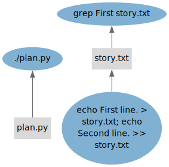

# Introduction

The "Getting Started" section consists of a series of short tutorials.
Each tutorial introduces a few concepts at a time to maintain a gentle learning curve.
The following initial competencies are assumed:

- Basic Python programming.
- Working with a virtual terminal.
- Editing text files.

Note that the examples in the tutorials are all small and use StepUp non-interactively.
We believe this offers the best learning experience.
However, StepUp really shines in more complex use cases and when used interactively.
Once you know how StepUp works, you can impress yourself by effortlessly mastering the daunting complexity of your projects. :)

## Tutorial source files

Input files for each tutorial are stored in a corresponding subdirectory under `docs/getting_started/` within StepUp Core's source code.
Each directory contains a script named `main.sh`,
which simply runs the example in non-interactive mode,
generating output that can be included in the documentation.

## StepUp architecture

The tutorials use terminology defined in this small architecture overview.
This overview summarizes the internals of StepUp, omitting many details for the sake of clarity.
It provides just enough to give a basic understanding of its core concepts.

### Workflow (graphs)

StepUp keeps track of what it needs to do and what it has already done in a workflow data structure.
This workflow is represented by *two* [direct acyclic graphs (DAGs)](https://en.wikipedia.org/wiki/Directed_acyclic_graph), which comprise the same nodes.

#### Nodes

The nodes of the graph can be instances of the following main classes:

- A `Step` defines a program that can be executed with all the information for a specific execution:
  working directory, command, arguments, inputs, outputs, etc.
  A step can also be in one of the following states:

    - `PENDING`: the step cannot yet be scheduled because some inputs have not been declared or built yet.
    - `QUEUED`: all inputs are available and the step is waiting to be executed.
    - `RUNNING`: the step is being executed by one of the workers.
    - `SUCCEEDED`: the step has been successfully completed.
    - `FAILED`: the subprocess exited with a non-zero exit code or some output files were not created.

- A `File` defines a path and a status, which can be any of the following:

    - `PENDING`: the file is the output of a step that still needs to be executed.
    - `BUILT`: the file is the output of a step that has been successfully executed.
    - `VOLATILE`: the file is (or can be) created by a step, but it is volatile.
      It cannot be used as input, no hashes are computed for it.
      These files are only registered so that they can be removed when appropriate.
    - `STATIC`: the file is written by you and can only be an input to a step.
      (Note that step inputs can also be outputs of previous steps.)
    - `MISSING`: a static file that has gone missing.

There are also a few special nodes:

- The `Root` node is the top-level node, of which there is only one.
- The `Vacuum` node is also unique and collects other nodes that will be deleted soon.
- A `DeferredGlob` node contains a [glob](https://en.wikipedia.org/wiki/Glob_(programming)) pattern of files that are made static when they are used as input.

#### Edges

The StepUp workflow has two types of directed edges (arrows) connecting pairs of nodes.
Each type of edge forms a graph with its own rules and logic.

- A **"supplier ➜ consumer"** edge points from a node that provides *something* to a node that uses that *something*.
  A few examples:

    - If a step uses a file as its input, it is the consumer of that file.
    - Likewise, a step is the supplier of its outputs
    - Every file is the consumer of its parent directory.
      (The only exceptions are `./` and `/`.)
    - A step is the consumer of its working directory.

    The following diagram from the [Dependencies tutorial](dependencies.md) illustrates this type of edge.
    (Directories are not included, steps are blue ellipses, files are grey rectangles.)

    

    The build algorithm in StepUp will traverse *up*wards through this graph as it executes the steps,
    similarly to [tup](https://gittup.org/tup/)

- A **"creator ➜ product"** edge is added whenever a new node is added to the workflow:
  Each node must have **one** creator, but nodes can have multiple products.
  Examples include:

    - A step is the creator of its output files.
    - If a `plan.py` (or other step) defines new steps, then the `./plan.py` step is the creator of
      the new steps.
    - If a step declares a static file, the step is the creator of the static file.
    - The initial `plan.py` step has the `Root` node as its creator.
    - Only the `Root` node is its own creator, making it the top-level node by construction.
    - When nodes are slated for removal, the `Vacuum` node becomes their creator.

    The following graph from the [Dependencies tutorial](dependencies.md) illustrates this type of edge.
    (Steps are blue ellipses, files are grey rectangles, root and vacuum are orange hexagons.)

    

### Processes

The following diagram illustrates how the components of StepUp interact. Legend:

- White boxes: your fingers and eyes
- Grey boxes: processes
    - The **terminal user interface** is the part of StepUp that you interact with when you run the `stepup` command.
    - The **director** holds the workflow data structure and is responsible for running steps and watching for file changes.
    - The **worker** processes execute steps and compute file and step hashes.
- Grey arrows: standard input (interactively usage only) and standard output.
- Yellow arrows: startup of subprocesses
- Blue arrows: remote procedure calls to control the director and the workers
- Purple arrows: remote procedure calls for progress updates
- Green arrows: remote procedure calls to extend the workflow

