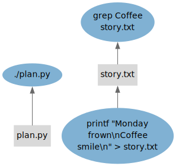
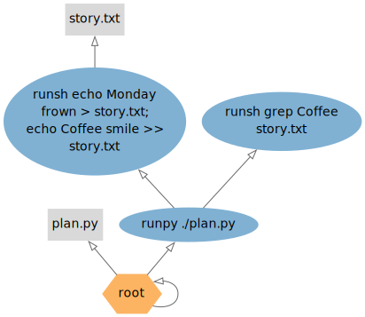
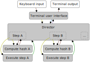

# Introduction

The "Getting Started" section consists of a series of short tutorials.
Each tutorial gradually introduces a few concepts to maintain a gentle learning curve.
The following initial competencies are assumed:

- Basic Python programming.
- Working with a virtual terminal.
- Editing text files.

Note that the examples in the tutorials are all small and use StepUp
in serial mode (`-n 1`) and non-interactively.
We believe this offers the best learning experience.
However, StepUp really shines in more complex use cases and when used interactively.
Once you become familiar with StepUp,
you'll be able to make workflows that would be difficult to manage with other tools.

## Tutorial source files

Input files for each tutorial are stored in a corresponding subdirectory under
[`docs/getting_started/`](https://github.com/reproducible-reporting/stepup-core/tree/main/docs/getting_started)
within StepUp Core's source code.
Each directory contains a script named `main.sh`,
which simply runs the example in non-interactive mode,
generating the outputs that are included in the documentation.

## StepUp architecture

The tutorials use terminology defined in the small architecture overview given below.
This overview summarizes the internals of StepUp, omitting many details for the sake of clarity.
It provides just enough background to get a basic understanding of its core concepts.

### Workflow (graphs)

StepUp keeps track of what it needs to do and what it has already done in a workflow data structure.
This workflow is represented by *two*
[direct acyclic graphs (DAGs)](https://en.wikipedia.org/wiki/Directed_acyclic_graph),
which comprise the same nodes.

#### Nodes

The nodes of the graph can be instances of the following two main classes:

1. A `Step` defines a program that can be executed with all the information for a specific execution:
   working directory, command, arguments, inputs, outputs, etc.
   A step can also be in one of the following states:

    - `PENDING`:
      the step cannot yet be scheduled
      because some inputs have not been declared or built yet.
    - `RUNNING`:
      the step is being executed by one of the workers.
    - `CHECKING`:
      the step has a stored hash from a previous successful run and is being compared
      against its current inputs and outputs to determine if execution can be skipped.
      Named resource restrictions do not apply in this state.
    - `SUCCEEDED`:
      the step has been successfully completed.
    - `FAILED`:
      the step failed because the subprocess exited with a non-zero exit code,
      or expected output files were not created.

2. A `File` defines a path and a status, which can be any of the following:

    - `AWAITED`:
      the file is the output of a step that has never been executed so far.
      (Such files are never deleted when cleaning up outputs.)
    - `BUILT`:
      the file is the output of a step that has been successfully executed.
    - `OUTDATED`:
      the file is the output of a step that has been executed,
      but inputs of the step have been modified since then.
    - `VOLATILE`:
      the file is (or can be) created by a step, but it is volatile.
      It cannot be used as input, no hashes are computed for it.
      These files are only registered so that they can be removed when appropriate.
      They are typically different every time they are created,
      even with the same inputs.
    - `STATIC`:
      the file is written by you and can only be an input to a step.
      (Note that step inputs can also be outputs of previous steps.)
    - `MISSING`:
      a static file that has gone missing.

There are also a few special nodes:

- The `Root` node is the top-level node, of which there is only one.
- A `StaticRoot` stores a directory name whose contents
  (also in subdirectories) can only be static files.

#### Edges

The StepUp workflow has two types of directed edges (arrows) connecting pairs of nodes.
Each type of edge is used to define a graph with its own rules and logic.

- The **"dependency graph"** consists of **"supplier ➜ consumer"** edges.
  This graph shows which nodes use information from other nodes when the workflow is executed.
  A few examples:

    - If a step uses a file as its input, it is the consumer of that file.
    - Likewise, a step is the supplier of its outputs

    The following diagram from the [Dependencies tutorial](dependencies.md)
    illustrates this type of edge.
    (Steps are blue ellipses, files are grey rectangles.)

    

    The build algorithm in StepUp will traverse *up*wards through this graph
    as it executes the steps, similarly to [tup](https://gittup.org/tup/).

- The **"provenance graph"** consists of **"creator ➜ product"** edges.
  An edge is added to this graph whenever a new node is created.
  Each (active) node must have **one** creator, but nodes can have multiple products.
  Examples include:

    - A step is the creator of its output files.
    - If a `plan.py` defines new steps, then the `./plan.py` step is the creator of
      the new steps.
      (The same goes for any other step creating new steps.)
    - If a step declares a static file, the step is the creator of the static file.
    - The initial `plan.py` step has the `Root` node as its creator.
    - Only the `Root` node is its own creator, making it the top-level node by construction.

    The following graph from the [Dependencies tutorial](dependencies.md)
    illustrates this type of edge.
    (Steps are blue ellipses, files are grey rectangles, root is an orange hexagon.)

    

### Software components

The following diagram illustrates how different components of StepUp interact. Legend:

- White boxes: your fingers and eyes
- Grey boxes: processes
    - The **terminal user interface** is the part of StepUp that you interact with
      when you run the `stepup` command.
    - The **director** holds the workflow data structure and is responsible
      for scheduling steps and watching for file changes.
    - Per step, there is a subprocess to compute **file hashes**.
    - Per step, there is a subprocess to execute the **step command**.
- Brown arrows: standard input and standard output.
- Yellow arrows: startup of subprocesses
- Blue arrows: remote procedure calls to control the director and the workers
- Purple arrows: remote procedure calls for progress updates
- Green arrows: remote procedure calls to extend the workflow

