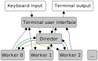

# Introduction

The "Getting Started" section consists of a series of short tutorials.
Each tutorial introduces a few concepts at a time to maintain a gentle learning curve.
The following initial competences are assumed:

- Basic Python programming.
- Working with a virtual terminal.
- Editing text files.

Note that the examples in the tutorials are all small and use StepUp non-interactively.
We believe this offers the best learning experience.
However, StepUp really shines in more complex use cases and when used interactively.
Once you know how StepUp works, you can impress yourself by effortlessly mastering the daunting complexity of your projects. :)

## Tutorial source files

Input files for each tutorial are stored in a corresponding subdirectory under `docs/getting_started/` in the source code of StepUp Core.
Each directory contains a script `main.sh` that simply runs the example in non-interactive mode,
to generate output that can be included in the documentation.

## StepUp architecture

The tutorials use terminology defined in this mini architecture overview.
The overview merely summarizes the internals of StepUp and omits plenty of details for the sake of clarity.
It provides just enough to get a basic understanding of its core concepts.

### Workflow (graph)

StepUp keeps track of what it must do and has already done in a workflow data structure.
This workflow is represented by a [direct acyclic graph](https://en.wikipedia.org/wiki/Directed_acyclic_graph).

#### Nodes

The nodes of the graph can be instances of the following main classes:

- A `Step` defines a program that can be executed with all information for a specific execution:
  working directory, command, arguments, inputs, outputs, etc.
  A step can also be in one of the following states:
    - `PENDING`: the step cannot be scheduled yet because some inputs are not declared or built yet.
    - `QUEUED`: all inputs are available and the step is waiting to be executed.
    - `RUNNING`: the step is being executed by one of the workers.
    - `SUCCEEDED`: the step has completed successfully.
    - `FAILED`: the subprocess exited with a nonzero exitcode or some output files were not created.
- A `File` defines a path and a status, which can be any of:
    - `PENDING`: the file is an output of a step that sill needs to be executed.
    - `BUILT`: the file is an output of a step that has been executed successfully.
    - `VOLATILE`: the file is (or may be) created by a step, but it is volatile.
      It cannot be used as input, no hashes are computed for it.
      These files are only registered to remove them when appropriate.
    - `STATIC`: the file is written by you, and can only be an input to a step.
      (Note that step inputs may also be outputs of other steps.)
    - `MISSING`: a static file that has gone missing.

There are also a few special nodes:

- The `Root` node is the top-level node, of which there is only one.
- The `Vacuum` node is also unique and collects other nodes that will soon be deleted.
- A `DeferredGlob` node contains a [glob](https://en.wikipedia.org/wiki/Glob_(programming)) pattern of files that are made static when they are used as inputs.

#### Edges

The StepUp workflow has two types of directed edges (arrows) that connect a pair of nodes:

- A **creator** edge is an arrow pointing from a node to its creator.
  It is added whenever the workflow is extended with a new node:
  every node must have a creator.
  The inverse arrows are also used in StepUp and are called **product** edges.
  A few examples:
    - A step is the creator of its output files.
    - When a `plan.py` (or other step) defines new steps, then `plan.py` step is the creator of
      the new steps.
    - When a step declares a static file, the step is the creator of the static file.
    - The initial `plan.py` step has the `Root` node as its creator.
    - Only the `Root` node is its own creator, making it the top-level node by construction.
    - When nodes are slated for removal, the `Vacuum` node becomes their creator.

- A **consumer** edge is an arrow pointing from a node to other nodes that use it (as input).
  The inverse arrows are also present in StepUp and are called **supplier** edges.
  A few examples:
    - When a step uses a file as input, it is the consumer of that file.
    - Each file is the consumer of its parent directory,
      except for `./` (for relative paths) and `/` (for absolute paths).
    - A step is the consumer of its working directory.

### Processes

The following schematic visualizes how the components of StepUp interact. Legend:

- White boxes: your fingers and eyes
- Grey boxes: processes
    - The **terminal user interface** is the part of StepUp that you interact when when running the `stepup` command.
    - The **director** holds the workflow datastructure and is responsible for running steps and watching for file changes.
    - The **worker** processes execute steps and compute file and step hashes.
- Grey arrows: standard input (interactively usage only) and standard output.
- Yellow arrows: startup of subprocesses
- Blue arrows: remote procedure calls to control the director and the workers
- Purple arrows: remote procedure calls for progress updates
- Geen arrows: remote procedure calls to extend the workflow

