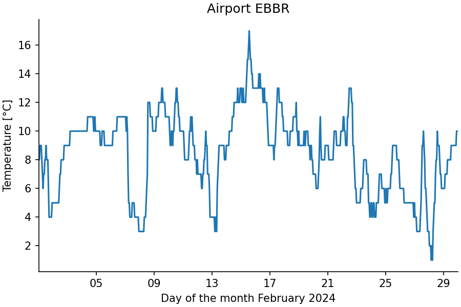
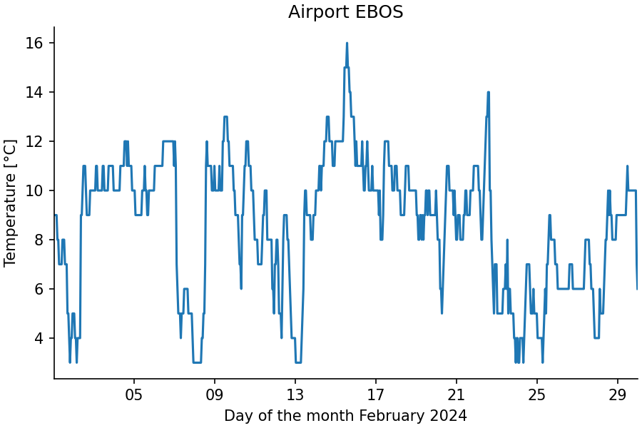

# Script (Multiple Cases)

In the [previous tutorial](script_single.md), the script protocol and driver
were illustrated with a single use case of a script.
The driver also handles scripts that can be executed with different combinations of inputs.


## Multiple Cases Script Driver

A Python script using the driver for multiple cases has the following structure.

```python
#!/usr/bin/env python
from stepup.core.script import driver

def cases():
    yield 1
    yield 2

CASE_FMT = "foo{}"

def case_info(case: int):
    return {
        "inp": ..., # a single input path or a list of input paths
        "out": ..., # a single output path or a list of input paths
        "just_any": "argument that you want to add",
    }

def run(inp, out, just_any):
    ...

if __name__ == "__main__":
    driver()
```

The script has the following elements:

- The generator `cases()` takes no arguments and yields cases that correspond to different ways of running the script.
  Here, the cases are simple integers `1` and `2`, but richer data are also supported.
  The `item` in `yield item` is translated into an `args` list and a `kwargs` dictionary as follows:

    - If `item` is a dictionary: `args = []; kwargs = item`
    - Else if `item` is a tuple of a list and a dictionary: `args, kwargs = item`
    - Else if `item` is a list or tuple: `args = list(item); kwargs = {}`
    - Else: `args = [item]; kwargs = {}`

- The cases will be represented by a string argument on the command line formatted with
  `CASE_FMT.format(*args, **kwargs)`, where `args` and `kwargs` are derived from the iterates
  from the `cases()` generator.
  The formatted string must retain all information of `args` and `kwargs`,
  so that they can be derived again from the formatted string
  with the [parse](https://github.com/r1chardj0n3s/parse) library.

    - Here, the two string representations will be `foo1` and `foo2`.
    - The corresponding steps will be `./script.py run foo1` and `./script.py run foo2`

- The function `case_info()` is used to translate `args` and `kwargs` into a more detailed
  planning of the run steps.

- The function `run()` works in the same way as for the single case script driver.


## Example

Example source files: [getting_started/script_multiple/](https://github.com/reproducible-reporting/stepup-core/tree/main/docs/getting_started/script_multiple)

To make the example more engaging,
it leverages [NumPy](https://numpy.org/) and [Matplotlib](https://matplotlib.org/).
The same plotting function is applied to two datasets of hourly temperatures recorded at
the airports of Brussels and Ostend in February 2024, downloaded from the
[ASOS network hosted by Iowa State University](https://mesonet.agron.iastate.edu/request/download.phtml).


Create a script `plan.py` that just calls the plotting script:

```python

```

The script `plot.py` uses the script driver with multiple cases:

```python

```

Make the scripts executable and run StepUp to get the results:

```bash
chmod +x plan.py plot.py
stepup -n -w1
```

You should see the following terminal output with the plan and run steps of the plotting script:

```

```

This produces the following figures:





## Try the Following

- Download temperature data for the same month of an airport close to your home and format it
  similarly to the `*.csv` already present.
  Extend the `cases()` generator to also process your temperature data.

- It is common for iterates of `cases()` to be reused by multiple scripts.
  One way to centralize this information is by defining a list `airports` in a `settings.py` module.
  By locally importing this module in the `cases()` function,
  the driver will make `settings.py` an input only of the planning step of the script:

    ```python
    def cases():
        from settings import airports
        yield from airports
    ```
